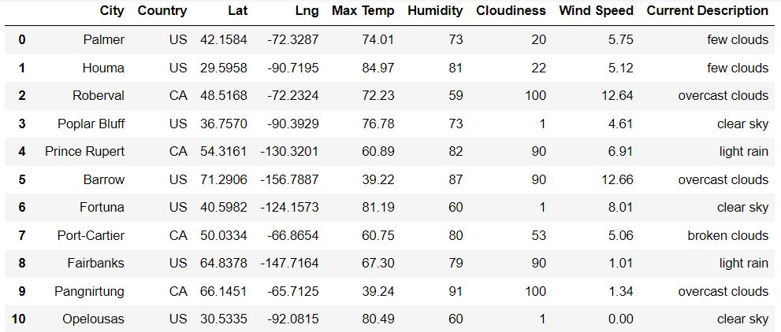

# World_Weather_Analysis - Module 6 Challenge
## Student Name: Christopher Mastrangelo

This was an interesting module, I really liked it.  And I like unicorns and rainbows.

## Deliverable # 1 - Retrieve Weather Data and Export to CSV

This is how the city_data_df looks before exported to the CSV file 

The WeatherPy_Database.ipynb notebook file and the CSV output file can be found in the Weather_Database folder. 
 File #1 - 
<a href="https://github.com/gcmastra/World_Weather_Analysis/blob/8e19b7e0cab8a8b902a97545805449c652c1be8b/Weather_Database/Weather_Database.ipynb">Weather_Database.ipynb</a>
 File #2 - 
<a href="https://github.com/gcmastra/World_Weather_Analysis/blob/8e19b7e0cab8a8b902a97545805449c652c1be8b/Weather_Database/WeatherPy_Database.csv">WeatherPy_Database.csv</a>

Please make note of the comments in the code, for example: 

## Deliverable # 2 Create a Customer Travel Destinations Map

The second deliverable includes a notebook, a CSV output file of cleaned hotel information, and a map with markers and info boxes with weather information.  The exact number of cities displayed on the map depends on the user input of the minimum and maximum temperature desired at their destination. 

When creating the map in the notebook, it worked and the map was displayed, and clicking the pins/markers on the map causes weather information to pop up.  However when using the download widget next to the cell to download the map as a png file, only the pins are displayed without the info boxes.  So I took a screen capture of the map with the info boxes showing and that is included below. 

Files are located in the folder "World_Weather_Analysis/Vacation_Search" - here are the links to the files:  
File # 1 - <a href="https://github.com/gcmastra/World_Weather_Analysis/blob/0ebcc04d9cff299134722e5982b20ded2085deff/Vacation_Search/Vacation_Search.ipynb">Vacation_Search.ipynb</a> 
File # 2 - <a href="https://github.com/gcmastra/World_Weather_Analysis/blob/0ebcc04d9cff299134722e5982b20ded2085deff/Vacation_Search/WeatherPy_vacation.csv">WeatherPy_vacation.csv</a> 
File # 3 - <a href="https://github.com/gcmastra/World_Weather_Analysis/blob/2e13a1cb5416a5edf3200b46fb35ed62388e1b56/Vacation_Search/gwu20210807_challenge_deliverable2_map_image_with_markers.JPG">Link to map image showing markers with weather info</a> 

## Deliverable # 3 - Create a Travel Itinerary Map

Files are saved in Vacation_Itinerary folder which is a subfolder of the main World_Weather_Analysis folder of this repository. 
File #1 - <a href="https://github.com/gcmastra/World_Weather_Analysis/blob/0ebcc04d9cff299134722e5982b20ded2085deff/Vacation_Itinerary/Vacation_Itinerary.ipynb">Vacation_Itinerary.ipynb</a>
 
File #2 - <a href="https://github.com/gcmastra/World_Weather_Analysis/blob/0ebcc04d9cff299134722e5982b20ded2085deff/Vacation_Itinerary/WeatherPy_travel_map.png">WeatherPy_travel_map.png</a> 
File #3 - <a href="https://github.com/gcmastra/World_Weather_Analysis/blob/0ebcc04d9cff299134722e5982b20ded2085deff/Vacation_Itinerary/WeatherPy_travel_map_markers.PNG">WeatherPy_travel_map_markers.PNG</a>  

                 
This is the travel itinerary map for four cities in USA

## Additional Information to be included in the report - Technical Challenges
### Errors found in online course materials

Unit 6.2.4 - near the end the following piece of code is pasted into the API_practice notebook

"#" Create an endpoint URL for a city." 
city_url = url + "&q=" + "Bston" 
city_weather = requests.get(city_url) 
if city_weather.json(): 
  print(f"City Weather found.") 
else: 
  print(f"City weather not found.") 
 
The lesson says this will result in city not found but it always returns TRUE because there is always a JSON response even if it contains the error code and messsage

Unit 6.2.6 - the following statement (see image) of the course material is intended to show the difference if the blanks are not parsed/replaced out of the city name before
generating the URL.  However, the links for Cabo and Cabo+San+Lucas still do not work because the API Key is not valid.  So to do this comparison you would 
have to build the URL yourself in your notebook using your own API Key which is easy to do . . . 

This is part of the JSON response for "Cabo" 
<ul><li>coord: {
lon: -35.0333,
lat: -8.2833
}</li>
</ul>

Whereas THIS IS Cabo+San+Lucas 
<ul>
  <li>coord: {
lon: -109.9124,
lat: 22.8909
}</li></ul>

So this illustrates that Cabo and Cabo+San+Lucas are two different cities- Cabo alone brings up Cabo De Santo Augustinho in Brazil pop 208,000

### A few more observations

But what about cities that share the same name like wilmington or springfield- how would you distinguish between Wilmington MA and Wilmington NC  ? ?

What about "bluff" ? Same issue as Cabo? other examples: bluff, bend,  or college ? the word college appears in many city names 

Hilo in HI shows up in EVERY RUN because it is the closest city to almost ANY point in the Pacific Ocean

I still don't know why we couldn't take the top 25 cities from each country and then shuffle those to get real places people will go

I think it is mostly to teach people how the random functions work and the citipy module works

Did a git push at the end of section 6.2.7

In Section 6.4.3, when copying/pasting the code directly out of the course materials, in two cases I got an unusual error message . . .

It doesn't like the line break or EOL character for some reason.  But when I copy/paste from another working cell in the notebook, 
and edit this line to look identical instead of pasting it in from the clipboard, the error goes away. 

### Some neat stuff I encountered along the way

First version of heat map in section 6.5.2 - the map "works" but something looks wrong.  What do you think? 

The map displays properly but based on the data we gave it, New York city is "hotter" than Texas or Mexico City.  That doesn't seem right.

Seems unlikely but if you ask Google Maps to show "Resorts" in a search centered on a random place in New Caledonia, you get this . . 

Is there really a resort in New Zealand for $17 per night? LETS GO! But the airfare might wipe out that savings.

There are some really cool places in Greenland but is anyone really going to go there? 

Just saying.  
